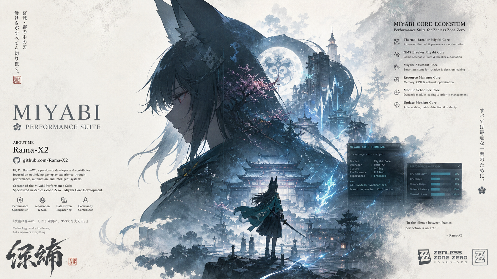

  

  <h1>Hi, I'm Ade Ramadhani Putra (Rama-X2)</h1>

  

    <b>Full Stack Developer</b> | <b>UI/UX Designer</b> | <b>Android Modder</b> | <b>Kernel & ROM Dev</b> | <b>Server Builder</b> 
    Based in Indonesia (West Java) &nbsp;•&nbsp; Self-taught & Passionate about Open Source
  

  

    
  

---

## Tech Stack & Tools

  

  
  
  

---

## What I Do

- **Web Development**: Building high-performance web applications with Next.js, React, Vue, Svelte, PHP, & Node.js.
- **Android Modding**: Developing Magisk Modules (overclocking, thermal tweaks, system hacks) & custom ROM/kernels.
- **Server & System Tuning**: Managing Linux servers, Docker containers, & low-level performance optimization.

---

## GitHub Stats

### Account Legacy & Contribution Data
> Waketime (coding hours): `3,800+ hours` (wakatime / local tracking)

<table border="0">
  <tr>
    <td valign="top" width="50%">
      <table>
        <thead>
          <tr>
            <th align="left">Statistics</th>
            <th align="center">Score</th>
          </tr>
        </thead>
        <tbody>
          <tr>
            <td align="left">Total Stars</td>
            <td align="center">12.3k</td>
          </tr>
          <tr>
            <td align="left">Total Commits</td>
            <td align="center">21.4k</td>
          </tr>
          <tr>
            <td align="left">Pull Requests</td>
            <td align="center">360</td>
          </tr>
          <tr>
            <td align="left">PR Reviewed</td>
            <td align="center">82</td>
          </tr>
          <tr>
            <td align="left">Issues Opened</td>
            <td align="center">214</td>
          </tr>
          <tr>
            <td align="left">Contribution of the Year</td>
            <td align="center">140+</td>
          </tr>
        </tbody>
      </table>
    </td>
    <td valign="top" align="center" width="50%">
      
    </td>
  </tr>
</table>

---

## Connect With Me

  
  
  

